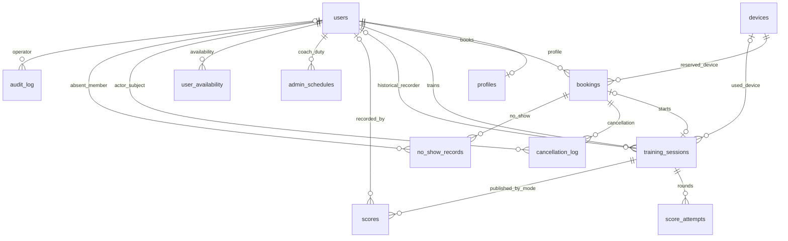

# 数据库设计 v1.0.0

基线：2026-09-26；2026-09-27 增补历史训练补录结构。当前为 **13 张业务表、17 个数据库外键**，统一位于 PostgreSQL `"ynu-shooting"` schema。实际定义见 [建表 SQL](../scripts/schema-postgresql.sql) 与 [实体目录](../src/main/java/com/ynu/shotting/entity)。H2 只用于隔离测试，不是云端业务库。

## 1. 命名、类型与关系

- 外键列采用 `[业务角色_]目标实体单数_id`，全部引用目标表的 `id`；`profiles.user_id` 同时是主键和外键。
- `admin`、教员、录分人都是 `users` 的角色或业务身份，没有独立教员表或角色关联表。
- 主键通常是 `BIGINT GENERATED BY DEFAULT AS IDENTITY`；`profiles` 使用共享用户主键。
- 日期时段保存为 `slot_date`（YYYY-MM-DD 字符串）和 `slot_id`（S1–S6）；时段定义在 Java `Slot` 与前端常量中，没有时段表。
- 时间字段是 `TIMESTAMP(6)`／Java `LocalDateTime`，数据库字段本身不存时区，业务统一解释为北京时间。提醒队列亦如此。
- 成绩为 `DOUBLE PRECISION`，应用限制一位小数并进行合计舍入；分组、逐发数组使用 TEXT 存 JSON，不是 JSONB。学员端目前只采集分组总分。

`wechat_reminders` 使用逻辑引用，不画成物理外键：`kind=TRAINING` 时 `target_id → bookings.id`；`kind=DUTY` 时 `target_id → admin_schedules.id`；`user_id → users.id`。这样删除排班后仍能保留提醒结果，发送前重新检查目标是否存在和所有权。

## 2. 全部表与关键字段

| 表 | 关键字段与用途 | 数据库约束／注意点 |
| --- | --- | --- |
| `users` | `id`、`openid`、`nickname`、`avatar_url`、`role`、`profile_status`、创建／更新时间 | openid 唯一；角色 student/admin/superadmin；资料状态 pending/completed |
| `profiles` | `user_id`、`real_name`、`student_no`、`phone`、`gender`、创建／更新时间 | user_id 共享主键；student_no 唯一；当前提交要求 M/F，旧记录允许缺失／U 待补全 |
| `devices` | `id`、`name`、`type`、`status`、创建／更新时间 | 枪种 rifle/pistol；状态 IDLE/BOOKED/IN_USE/MAINTENANCE/DISABLED |
| `bookings` | 用户／设备、日期／时段、`status`、预约／签到／开始／结束时间、取消原因、两个占位字段 | 两个占位字段各自唯一；普通非空外键；设备占位与用户占位释放时机不同 |
| `training_sessions` | `booking_id`、用户／设备、初始 `mode`、`started_at`、`ended_at`、`resume_started_at`、`actual_duration_min`、`created_at` | 普通训练 booking_id 非空且唯一；历史补录 booking_id/device_id 为空，使用 historical_weapon、recorded_by_user_id、history_request_key/hash；CHECK 约束区分来源；mode 为初始默认，轮次可混合 |
| `score_attempts` | `training_session_id`、`mode`、`request_key`、`total_score`、`group_totals`、`shot_scores`、`group_scores`、`recorded_at` | `(training_session_id,request_key)` 唯一防重试重复；mode 必填；SQL 总分粗校验 0–600，决赛 240 上限由应用进一步校验 |
| `scores` | `training_session_id`、`mode`、总分、分组均值／逐发数据／分组发数 JSON、发数、X 数、录分人、登记时间 | `(training_session_id,mode)` 唯一；一个训练每种赛制至多一条最终成绩；录分人可空 |
| `admin_schedules` | `admin_user_id`、日期／时段、`arrived_at`、`departed_at`、`created_at` | `(admin_user_id,slot_date,slot_id)` 唯一；离场需有到岗且离场不早于到岗；不再含 device_id |
| `user_availability` | 用户、日期／时段 | 当前 SQL 未设置用户日期时段唯一约束；业务更新通过用户锁及集合去重处理 |
| `cancellation_log` | 预约、用户、`reason`、`level`、创建时间 | level 为 free/late/near_no_show；不等同于自动惩罚或扣费 |
| `no_show_records` | 用户、预约、创建时间 | 对应超时未签到；状态转换和事务防止重复登记，不额外声明 booking_id 唯一 |
| `audit_log` | 可空 `admin_user_id`、`action`、逻辑目标 `target_user_id`、TEXT `detail`、创建时间 | 记录管理／更正操作；业务留痕，不是数据库不可篡改账本 |
| `wechat_reminders` | `kind`、`target_id`、`user_id`、模板、状态、计划／开始／重试／订阅／认领／发送时间、次数、结果码 | `(kind,target_id)` 唯一；`(status,next_attempt_at)` 索引；用户／目标为逻辑引用；不保存 AppSecret/access_token |

### 所有物理外键

| 来源字段 | 目标 |
| --- | --- |
| `profiles.user_id` | `users.id` |
| `bookings.user_id` | `users.id` |
| `bookings.device_id` | `devices.id` |
| `training_sessions.booking_id` | `bookings.id` |
| `training_sessions.user_id` | `users.id` |
| `training_sessions.device_id` | `devices.id` |
| `training_sessions.recorded_by_user_id` | `users.id` |
| `score_attempts.training_session_id` | `training_sessions.id` |
| `scores.training_session_id` | `training_sessions.id` |
| `scores.recorded_by_user_id` | `users.id` |
| `admin_schedules.admin_user_id` | `users.id` |
| `user_availability.user_id` | `users.id` |
| `cancellation_log.booking_id` | `bookings.id` |
| `cancellation_log.user_id` | `users.id` |
| `no_show_records.booking_id` | `bookings.id` |
| `no_show_records.user_id` | `users.id` |
| `audit_log.admin_user_id` | `users.id` |

约束名为 `fk_来源表__外键列__目标表`。`audit_log.target_user_id`、提醒表的逻辑 ID 以及 `slot_id` 都没有物理外键；不能仅凭 `_id` 后缀推断数据库约束。

## 3. 预约占位与状态

| 状态 | 设备占位 | 用户占位 | 计入每日／每周配额 |
| --- | --- | --- | --- |
| BOOKED | 保留 | 保留 | 是 |
| CHECKED_IN | 保留 | 保留 | 是 |
| IN_USE | 保留 | 保留 | 是 |
| COMPLETED | 释放 | 保留 | 是 |
| CANCELLED | 释放 | 释放 | 否 |
| NO_SHOW | 释放 | 释放 | 否 |

`occupied_device_slot` 格式为 `deviceId:date:slotId`，用户占位相应为 `userId:date:slotId`。JPA 生命周期回调同步这两个字段。PostgreSQL 唯一约束允许多个 NULL，因此取消／完成释放设备后可供其他人使用。

`devices.status=IN_USE` 表示当前物理使用；不能代替预约表判断所有未来时段。未来预约按设备、日期、时段和有效预约查询，当前仍在训练不会关闭未来空闲时段。

关键业务使用数据库悲观锁及事务。`VenueAccess` 按固定 ID 顺序锁场地设备行，协调排班、教练离场、预约、训练和提醒认领；与占位唯一约束共同保证冲突检查。当前未使用 Redis 分布式锁。

直接执行 SQL 修改预约状态不会运行 JPA 占位回调，可能留下不一致占位；运维不应随意手改这些字段或强制将使用中设备置为空闲。

## 4. 训练成绩、日期与更正

- 训练轮次和发布成绩分开：`score_attempts` 是实际登记明细，`scores` 是模式内最高成绩及旧版最终成绩。
- 新分组输入计算 `group_totals` 和总分，并在兼容字段保存组均值；不把组均值伪造为逐发实测数据，`shot_scores` 可为 `[]`。
- 结束时按模式结算；补登和更正也按模式更新。旧版没有轮次的成绩保留，不能删除后凭空重建明细。
- 当日教练榜不是独立表，按 `training_sessions.started_at` 的北京日期查询当日全部训练，合并轮次和兼容最终成绩，按学员／枪种／赛制取最高值。
- 个人最佳及综合榜同样按需计算，没有物化榜单表；无需迁移排行榜缓存。
- `recorded_at` 是登记／发布时间，可能晚于训练日期；不能替代实际开枪时间。
- 恢复训练保留首次 `started_at`，用 `resume_started_at` 累计有效时长，结束时间可再次更新。不是一段不可变的连续区间。
- 成绩更正通过预期状态摘要检查并发；变更前后值、原因及操作者写审计。数据库未新增独立 revision 列。

## 5. 提醒队列

`kind` 为 TRAINING 或 DUTY；业务状态为 PENDING、SENDING、SENT、FAILED、UNKNOWN、SKIPPED、CANCELLED。SQL 列为字符串，状态合法性主要由枚举及业务控制。

一项预约或值班最多保留一条提醒队列行。同一目标重新合法订阅时更新原行；并不记录每次订阅的完整独立历史。先在事务内认领 SENDING，再在事务外请求微信，最后写回结果。

发送前重新校验所有权、目标状态、开始时间和模板。排班删除或资格变化可使任务跳过。网络结果不确定时不盲目重发；数据库队列不是精确一次送达保证，`SENT` 也不是手机已读回执。

## 6. 初始化与迁移

### 新数据库

使用 [schema-postgresql.sql](../scripts/schema-postgresql.sql) 创建当前完整结构。`init.sql` 只是本地演示种子，不在业务库导入。账号和数据库本身需先创建，生产表所有者使用应用账号。`CREATE TABLE IF NOT EXISTS` 不会升级已有旧表。

### 已有数据库

先确认当前结构、停止服务并备份，再选择必要迁移；下表是依赖顺序，不是要求每次手工重复执行所有脚本。

| 顺序 | 脚本 | 作用 |
| --- | --- | --- |
| 1 | `migrate-venue-duty.sql` | 设备排班改为教室排班，合并同教练重复设备排班，补到离场字段 |
| 2 | `migrate-foreign-key-names.sql` | 旧 admin_id/session_id/recorded_by 改为统一外键名，补约束名与注释 |
| 3 | `migrate-score-attempts.sql` | 增加逐轮成绩表 |
| 4 | `migrate-training-resume.sql` | 增加恢复训练计时字段 |
| 5 | `migrate-mixed-training-modes.sql` | 回填轮次 mode，最终成绩唯一键改为训练＋模式 |
| 6 | `migrate-wechat-reminders.sql` | 新增提醒队列及索引 |
| 7 | `migrate-historical-training.sql` | 历史训练来源、补录教员、幂等键及关联约束 |

以上脚本在项目既有结构前提下设计为可重复执行；必须审阅对应升级脚本的前置检查。当前 `upgrade-coach-daily.sh` 要求已具备混合模式结构，补齐提醒表并迁移历史补录结构后替换 JAR，不代替更早版本全部迁移。

混合模式迁移改变 `scores` 的唯一性：旧单模式 JAR 不兼容。该迁移发生后的失败不能只恢复旧 JAR；应先检查原因，再按明确方案恢复配套程序／数据库。当前按日视图与未来预约修复本身没有额外表结构变更。2026-09-27 历史补录需要另行迁移；已有补录数据后旧 JAR 不兼容。

生产使用 `DB_DDL_AUTO=validate`。Hibernate `update` 不能代替列重命名、数据回填或约束替换。当前没有 Flyway/Liquibase 自动版本表，需将执行脚本、时间、哈希和备份位置写入部署记录。

## 7. 维护边界

- schema 名含连字符，SQL 中必须写 `"ynu-shooting"`；不要误用 `ynu_shotting` 或回退到 `public`。
- 外键未配置通用数据库级联删除；JPA 部分关联存在 cascade，但不代表可直接清空用户或训练历史。
- 除主键／唯一约束带来的索引外，当前显式新增的提醒扫描索引为 `idx_reminder_due`。后续数据增大可按实际查询计划补日期／用户索引。
- `user_availability`、日志等并非全部有防重复唯一键；完整性同时依赖事务与业务校验。
- 真实数据库文件、SQL dump、备份和含资料日志不入 Git；源码版本回退不自动回退数据库。
- 当前 SQL 标注 PostgreSQL 14+，实际独立数据库测试使用 PostgreSQL 18；不宣称对所有数据库版本逐一验收。

历史补录详细业务与回退边界见[教员历史训练补录](../../docs/教员历史训练补录.md)。
